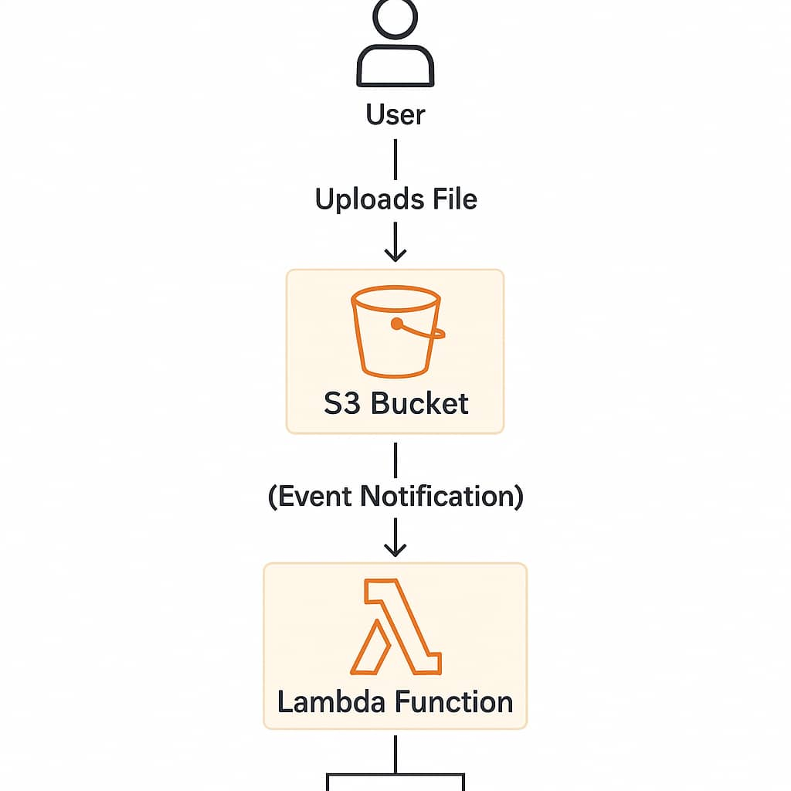

# 🚀 Week 5: Deploy AWS Lambda Function with S3 Trigger using Terraform

## 📌 Goal

Learn how to build an event-driven serverless architecture by deploying an *AWS Lambda function* that is automatically triggered when a file is uploaded to an *S3 bucket, using **Terraform* for infrastructure as code.

---

## 📐 Architecture Overview

---

🛠 What We’re Building

✅ S3 Bucket: Receives uploaded files.

✅ Lambda Function (Python): Gets triggered on file upload.

✅ IAM Role & Policies: Allow Lambda to read from S3 and log to CloudWatch.

✅ Terraform Modules: Infrastructure is fully provisioned using Terraform.

✅ CloudWatch Logging: Output of Lambda function is logged for debugging.

---

📁 Project Structure

aws-s3-lambda/
├─
│   ├── lambda/
│   │   ├── lambda_function.py     # Python Lambda code
│   │   ├── lambda.zip             # Zipped Lambda package (generated)
│   │   └── zip.sh                 # Script to zip the Lambda code
│   ├── main.tf                    # Terraform main config
│   ├── provider.tf                # AWS provider configuration
│   ├── variables.tf               # Variable definitions
│   └── outputs.tf                 # Output values
├           
└── README.md

---

📜 Prerequisites

✅ AWS CLI installed and configured (aws configure)

✅ Terraform installed (terraform -v)

✅ AWS IAM permissions to manage Lambda, S3, and IAM resources

✅ Python 3 (for test uploads)

---

🚀 Deployment Steps

1. Zip the Lambda Code

cd Terraform/lambda/
./zip.sh

> Make sure lambda.zip is created inside the lambda/ directory.

---

2. Initialize Terraform

cd aws-s3-lambda/
terraform init

---

3. Apply the Infrastructure

terraform apply

This will create:

An S3 bucket

A Lambda function

IAM roles/policies

CloudWatch logs

---

🧪 How to Test the Setup

🔸 Method 1: Upload Manually from Console

1. Open the S3 Console

2. Navigate to the created bucket

3. Click “Upload” and add any file

🔸 Method 2: Upload via Shell Script

./upload_test_file.sh 

This will:

Create a test file

Upload it to the S3 bucket

Trigger the Lambda function

 ### Optional but recommended

You can just create a testfile.txt using 

touch testfile.txt

 then upload to your s3 bucket using this command  

aws s3 cp test_file.txt s3://<bucket-name>

---

🔍 Check Lambda Output

Via CloudWatch:

1. Open the CloudWatch Console

2. Navigate to:

Logs > Log groups > /aws/lambda/lambda-s3-trigger_lambda

3. Check the latest log stream

You should see the event log from the uploaded S3 file.

---

🧹 Cleanup

To tear down everything created:

terraform destroy

---

📎 Notes

The Lambda function handler is defined as:

def lambda_handler(event, context):
    print(json.dumps(event))

You can modify this to process images, parse CSVs, send notifications, etc.

Ensure you re-run zip.sh any time you update the Python code before reapplying with Terraform.

🧠 Learning Outcome

You now understand:

How to use Terraform to deploy serverless Lambda functions

How to create S3 event triggers

How to automate cloud infrastructure and event-driven pipelines